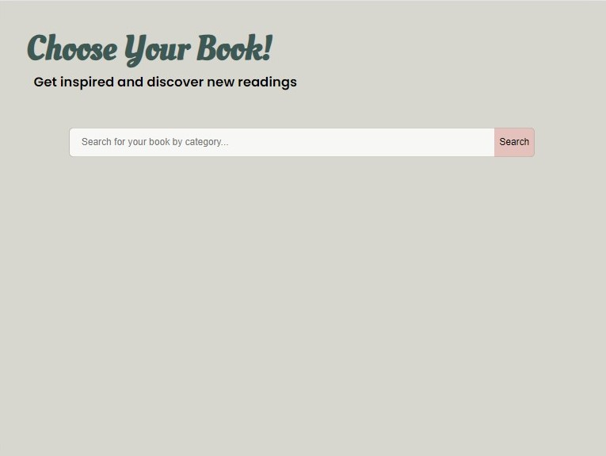
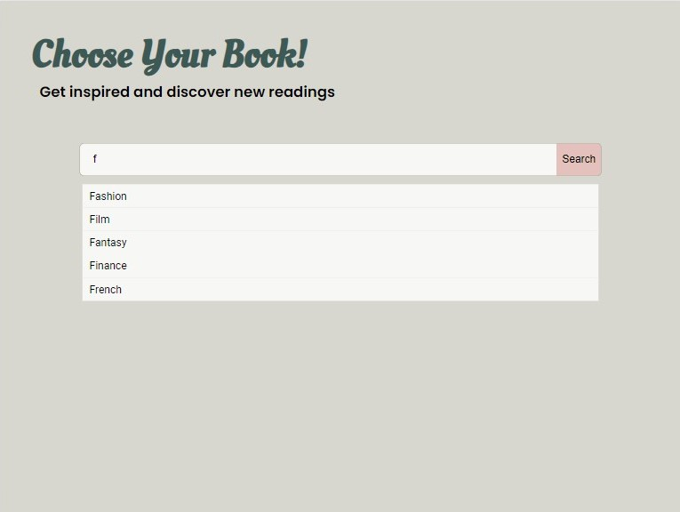
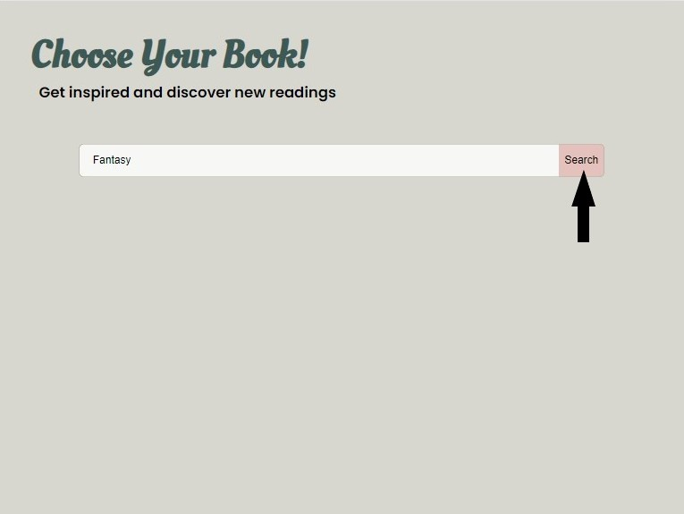
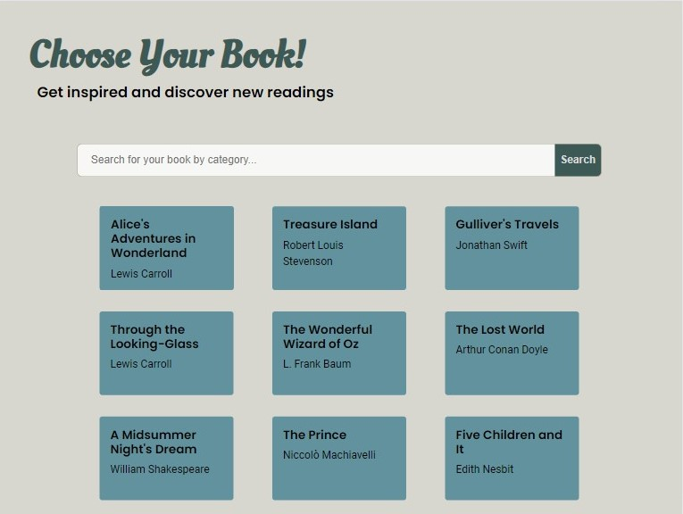
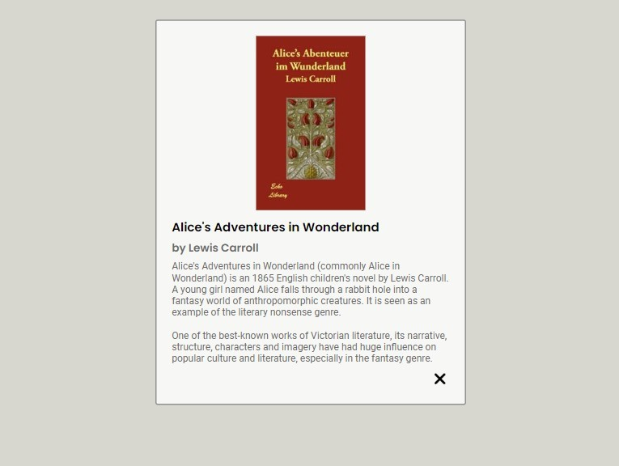

# Choose Your Book!

"Choose Your Book!" è un'applicazione che consente agli utenti di esplorare il vasto mondo dei libri in base alle loro categorie preferite. L'interfaccia utente, semplice e intuitiva, è dotata di un textbox per la ricerca di libri in una specifica categoria.

Una volta effettuata la ricerca, l'applicazione si interfaccia con le API di Open Library per ottenere un elenco di libri corrispondenti. L'utente può quindi visualizzare i titoli dei libri e gli autori.

Con un semplice clic su un libro, l'applicazione recupera e mostra la descrizione del libro, offrendo così un'esperienza di lettura più coinvolgente e personalizzata. Scegli il tuo libro e immergiti nel mondo della lettura! 


## Demo 


Schermata iniziale: Questa immagine mostra la schermata iniziale dell’applicazione, con un campo di ricerca pronto per l’input dell’utente.


Suggerimenti di ricerca: Dopo aver inserito una lettera nel campo di ricerca, l’applicazione mostra una serie di suggerimenti. Questa funzionalità aiuta gli utenti a trovare rapidamente ciò che stanno cercando. 


Ricerca per genere: In questa immagine, l’utente ha inserito il genere del libro nel campo di ricerca e ha cliccato su “Search”. Questa funzionalità permette agli utenti di cercare libri specifici per genere.


Risultati della ricerca: Dopo aver cliccato su “Search”, l’applicazione mostra i risultati della ricerca. Ogni risultato include il titolo del libro e l’autore.


Informazioni sul libro: Dopo aver cliccato sul titolo di un libro, l’applicazione mostra una schermata con le informazioni dettagliate del libro. Queste informazioni includono la descrizione del libro e un’immagine di copertina.

## Links

[ChooseYourBook!](https://dora2607.github.io/Progetto-JavaScript-Advance-di-Addolorata-Sparagno/): per provare l'applicazione.

## Installazione

Per iniziare a lavorare su "Choose Your Book!", è necessario seguire alcuni passaggi di installazione.

1. **Node.js**: Il primo passo è l'installazione di Node.js, che fornisce l'ambiente di runtime per eseguire l'applicazione e include `node_modules`, una directory che contiene tutti i pacchetti necessari per il progetto.

```bash
npm init -y
```
Questo comando inizializza un nuovo progetto Node.js.

2. **Webpack**: Successivamente, installa Webpack, un modulo bundler, utilizzando i seguenti comandi:

```bash
npm i -D webpack webpack-cli
npx webpack init
```
Questi comandi installano Webpack come dipendenze di sviluppo e generano un file di configurazione Webpack di base.

3. **File di configurazione Webpack**: Il file di configurazione Webpack è stato poi personalizzato per soddisfare le esigenze specifiche del progetto. Questo file gestisce vari aspetti dell’applicazione, tra cui l’ingresso e l’uscita dei file, il server di sviluppo, i plugin e le regole per la gestione di diversi tipi di file.
Ecco una descrizione dettagliata di ciascuna sezione:

- **Import dei Moduli**: I moduli `path`, `HtmlWebpackPlugin`, `MiniCssExtractPlugin` e `webpack` vengono importati all'inizio del file. Questi moduli forniscono funzionalità essenziali per la configurazione di Webpack.

- **Variabili di Ambiente**: La variabile `isProduction` viene utilizzata per determinare se l'applicazione è in modalità di produzione o di sviluppo. Questo influisce su come i fogli di stile vengono gestiti, come indicato dalla variabile `stylesHandler`.

- **Configurazione di Base**: L'oggetto `config` contiene le impostazioni di base per Webpack. Questo include le opzioni `entry` e `output`, che specificano rispettivamente il punto di ingresso dell'applicazione e dove i file di output devono essere salvati.

- **DevServer**: L'opzione `devServer` viene utilizzata per configurare il server di sviluppo di Webpack.

- **Plugins**: L'array `plugins` contiene tutti i plugin utilizzati da Webpack. Questo include `HtmlWebpackPlugin`, che crea un file HTML che include tutti i bundle di output, e `webpack.ProvidePlugin`, che rende disponibili globalmente i moduli `axios` e `lodash`.

- **Module Rules**: L'opzione `module.rules` specifica come Webpack deve gestire diversi tipi di file. Questo include la trasformazione di file JavaScript con Babel, l'elaborazione di file CSS e il caricamento di risorse come immagini e font.

- **Esportazione del Modulo**: Infine, il modulo viene esportato con una funzione che modifica la configurazione in base alla modalità corrente (produzione o sviluppo).


4. **Axios e Lodash**: Infine, per lavorare con le API, sono stati installati Axios, un client HTTP basato su promesse, e Lodash, una libreria di utility JavaScript.

```bash
npm install axios lodash
```

## Utilizzo dell'applicazione

"Choose Your Book!" è un'applicazione web sviluppata con Webpack. La struttura del progetto è organizzata in modo da facilitare lo sviluppo e la manutenzione del codice.

La cartella `src` contiene tutti i file sorgente del progetto. Questi includono:

- `index.html`: Il file HTML principale che funge da scheletro per l'applicazione.
- `index.js`: Il file JavaScript principale che avvia l'applicazione.
- `css`: Una cartella che contiene tutti i fogli di stile CSS.
- `asset`: Una cartella che contiene tutte le risorse multimediali utilizzate nell'applicazione. Questa cartella è suddivisa in `img` e `logo`, che contengono rispettivamente le immagini e i loghi utilizzati.
- `js`: Una cartella che contiene tutti i file JavaScript aggiuntivi. Questi file contengono le diverse funzioni utilizzate per sviluppare il progetto.

Dopo la compilazione con Webpack, tutti i file di output vengono salvati nella cartella `dist`.

Nelle sezioni seguenti, esamineremo più in dettaglio ciascuna delle funzioni utilizzate nel progetto. Continua a leggere per saperne di più!

### File `index.js`

Il file `index.js` è il punto di ingresso dell'applicazione. Ecco una descrizione dettagliata di ciascuna parte del codice:

- **Import dei Moduli e delle Librerie**: All'inizio del file, vengono importati i moduli e le librerie necessarie, tra cui il foglio di stile CSS, la libreria Lodash e le immagini utilizzate nell'applicazione.

```javascript
import "./css/style.css";
const _ = require("lodash");
const coverContext = require.context('./asset/img', false, /cover[1-3]\.jpg$/);
const covers = coverContext.keys().map(coverContext);
import iconsX from "./asset/img/iconsX.png";
const logoContext = require.context('./asset/logo', false, /\.(png|jpe?g|svg)$/);
const logos = logoContext.keys().map(logoContext);
```
 La funzione require.context. crea un contesto che permette di importare dinamicamente un gruppo di file. In questo caso, sta importando tutte le immagini (.png, .jpg, .jpeg, .svg) dalla cartella asset/logo.

La funzione require.context prende tre argomenti:

- Il percorso della directory da cui importare i file.
- Un flag booleano che indica se deve cercare nelle sottodirectory.
- Un’espressione regolare che corrisponde ai file da importare.

Il metodo keys restituisce un array di tutte le chiavi possibili (i percorsi dei file) che il contesto può importare. Il metodo map viene quindi utilizzato per importare effettivamente tutti i file.

- **Import delle Funzioni**: Successivamente, vengono importate diverse funzioni da altri file JavaScript. Queste funzioni sono utilizzate per creare oggetti di libri, mostrare suggerimenti, creare anteprime, ottenere informazioni sui libri e mostrare modali.

```javascript
const subjects = require("./js/subjects");
const showSuggestions = require("./js/showSuggestions");
const createObj = require("./js/createObj");
const createPreview = require("./js/createPreview");
const getInfoBook = require("./js/getInfoBook");
const showModal = require("./js/showModal");
```
- **Event Listener**: Vengono aggiunti degli event listener alla barra di ricerca e al pulsante di ricerca. Quando l’utente inserisce del testo nella barra di ricerca, vengono mostrati dei suggerimenti. Quando l’utente fa clic sul pulsante di ricerca, l’applicazione crea un’anteprima dei libri corrispondenti alla ricerca dell’utente.

1. **searchBar Event Listener**
```javascript
const searchBar = document.getElementById("searchBar");
if (searchBar != null) {
  searchBar.addEventListener("input", function () {
    const value = this.value;
    showSuggestions(value, subjects);
  });
}
```
In questo frammento di codice viene aggiunto un “ascoltatore di eventi” alla barra di ricerca dell’applicazione. Quando l’utente digita o modifica il testo nella barra di ricerca, vengono mostrati dei suggerimenti. Questo viene fatto attraverso la funzione showSuggestions, che viene chiamata ogni volta che l’utente inserisce del testo nella barra di ricerca. Quando l’utente fa clic sul pulsante di ricerca, l’applicazione crea un’anteprima dei libri corrispondenti alla ricerca dell’utente.

2. **searchButton Event Listener**
```javascript
const searchButton = document.querySelector(".searchButton");
searchButton.addEventListener("click", async () => {
  const searchBar = document.getElementById("searchBar");
  let newUserInput = searchBar.value;
  if (newUserInput === "") {
    alert("Enter text to search");
    return false;
  } else {
    let userInput = newUserInput.toLowerCase();
    userInput = userInput.replace(/ /g, "");
    await createPreview(userInput);
    searchBar.value = "";
    const linkDescription = document.querySelectorAll(".linkDescription");
    linkDescription.forEach((link) => {
      link.addEventListener("click", async (e) => {
        e.preventDefault();
        let  bookCardId = link.parentNode.parentNode;
        let coverKey = bookCardId.id;
        let key = link.id;
        let showInfoBook = await getInfoBook(key,coverKey);
        showModal(link, showInfoBook[0].description, showInfoBook[0].coverBook);
        const modalBook = document.getElementById("modalBook");
        modalBook.style.display = "flex";
        const results = document.getElementById("results");
        results.style.display = "none";
      });
    });
  }
});
```
Questo codice aggiunge un ascoltatore di eventi al pulsante di ricerca. Questo innesca una serie di operazioni asincrone: la creazione di un’anteprima dei libri corrispondenti alla ricerca dell’utente e la visualizzazione delle informazioni dettagliate del libro quando l’utente fa clic su un link di descrizione del libro.
Le funzioni asincrone createPreview e getInfoBook vengono utilizzate per ottenere e visualizzare queste informazioni. Queste funzioni utilizzano la parola chiave await per attendere che le promesse si risolvano, permettendo al codice di essere scritto in uno stile sincrono pur mantenendo i vantaggi della programmazione asincrona.
Inoltre, se la barra di ricerca è vuota, viene mostrato un messaggio di avviso all’utente, garantendo un’esperienza utente fluida e intuitiva.

1. **searchBar Event Listener 2**
```javascript
searchBar.addEventListener("click", function() {
  modalBook.style.display = "none";
  const results = document.getElementById("results");
  results.style.display = "flex";
});
```
Questo codice assicura che quando l’utente fa clic sulla barra di ricerca, qualsiasi modale aperto viene chiuso e i risultati della ricerca vengono mostrati.

### File `subjects.js`

Nel file subjects.js sono contenuti i possibili generi dei libri. Questo file consiste in un array che elenca tutti i generi letterari che possono essere suggeriti all’utente. Questi generi vengono utilizzati dalla funzione showSuggestions per fornire suggerimenti pertinenti all’utente durante la ricerca di libri. In questo modo, l’applicazione può offrire suggerimenti di ricerca più precisi e utili. 

### File `showSuggestions.js`
Nel file showSuggestions.js è contenuta la funzione `showSuggestions`, la quale è progettata per mostrare suggerimenti di ricerca all'utente mentre digita nella barra di ricerca. Ecco una descrizione dettagliata di come funziona:

- **Recupero dell'elemento di suggerimento**: La funzione inizia recuperando l'elemento HTML con l'ID "suggestions". Questo elemento è dove verranno visualizzati i suggerimenti di ricerca.
```javascript
  const suggestions = document.getElementById("suggestions");
  suggestions.style.display = "none";
  suggestions.innerHTML = "";
```

- **Filtro dei suggerimenti**: Se l'utente ha digitato qualcosa nella barra di ricerca (`value.length > 0`), la funzione filtra l'array `subjects` per trovare le corrispondenze. Una corrispondenza è un elemento in `subjects` che inizia con il testo digitato dall'utente.

- **Visualizzazione dei suggerimenti**: Se ci sono delle corrispondenze, la funzione crea un nuovo elemento `<div>` per ciascuna corrispondenza e lo aggiunge all'elemento "suggestions". Ogni `<div>` mostra un suggerimento e ha un ascoltatore di eventi "click" che imposta il valore della barra di ricerca sul suggerimento cliccato e nasconde l'elemento "suggestions".

```javascript
  if (value.length > 0) {
    let matches = subjects.filter(function (subject) {
      return subject.toLowerCase().startsWith(value.toLowerCase());
    });
    if (matches.length > 0) {
      suggestions.style.display = "block";
      matches.forEach(function (match) {
        let div = document.createElement("div");
        div.classList.add("showSuggestionStyle");
        div.innerHTML = match;
        div.onclick = function () {
          document.getElementById("searchBar").value = match;
          suggestions.style.display = "none";
        };
        suggestions.appendChild(div);
      });
    }
  }
```

### File `createObj.js`

La funzione createObj è una funzione asincrona che crea un array di oggetti contenenti dettagli sui libri per una determinata categoria. Ecco una descrizione dettagliata di come funziona:

- **Parametro di ingresso**: Questa funzione prende un parametro di ingresso, category, che rappresenta il genere a cui appartiengono libri da cercare.

- **Richiesta API**: La funzione fa una richiesta GET alle API di Open Library per ottenere informazioni sui libri della categoria specificata.
```javascript
const response = await axios.get(
  "https://openlibrary.org/subjects/" + category + ".json"
);
```

- **Creazione dell’array di oggetti**: La funzione poi crea un array di oggetti, dove ogni oggetto rappresenta un libro e contiene dettagli come la chiave del libro, il titolo, l’autore e la chiave dell’edizione di copertina.
```javascript
const obj = response.data.works;
const objArray = [];
obj.forEach((element) => {
  let newObj = {};
  newObj["key"] = element.key;
  newObj["title"] = element.title;
  newObj["author"] = element.authors
    .map(function (author) {
      return author.name;
    })
    .join(", ");
  newObj["cover"] = element.cover_edition_key;
  objArray.push(newObj);
});
```
Infine, la funzione restituisce l’array di oggetti creato.

### File `createPreview.js`

Il file createPreview.js contiene una funzione createPreview, ovvero una funzione asincrona che crea un’anteprima dei libri per un determinato genere. Ecco una descrizione come funziona:

- **Recupero delle informazioni sui libri**: La funzione inizia chiamando la funzione createObj con la categoria specificata. Questa funzione restituisce un array di oggetti, dove ogni oggetto rappresenta un libro e contiene dettagli come la chiave del libro, il titolo, l’autore e la chiave dell’edizione di copertina.

```javascript
const bookInfo = await createObj(category);
```
- **Gestione dei risultati vuoti**: Se non ci sono libri per la categoria specificata, viene mostrato un messaggio di avviso all’utente.
```javascript
if (bookInfo.length === 0) {
  alert("No results found!");
}
```
Creazione dell’anteprima: Se ci sono dei libri, la funzione crea un elemento <div> per ciascun libro e lo aggiunge all’elemento “results”. Ogni <div> mostra il titolo e l’autore del libro.
```javascript
else {
  const results = document.getElementById("results");
  results.innerHTML = "";
  bookInfo.forEach((book) => {
    const card = document.createElement("div");
    card.classList.add("bookCard");
    card.id = book.cover;
    const title = document.createElement("h4");
    const linkDescription = document.createElement("a");
    linkDescription.id = book.key;
    linkDescription.textContent = book.title;
    linkDescription.classList.add("linkDescription");
    const author = document.createElement("p");
    author.textContent = book.author;
    title.appendChild(linkDescription);
    card.appendChild(title);
    card.appendChild(author);
    results.append(card);
  });
}
```
Nel processo di creazione delle anteprime dei libri, la book.key viene assegnata all’ID del titolo del libro, che è un link, e la chiave (book.cover) della copertina viene assegnata all’ID del <div> (card), che contiene tutte le informazioni del libro.

Questo approccio ha due vantaggi significativi:

**Efficienza delle chiamate API**: Quando si chiama la funzione getInfoBook, non si effettuano chiamate API inutili. Poiché ogni libro ha una book.key e una chiave di copertina univoca, si possono recuperare direttamente le informazioni specifiche di quel libro.

**Accesso diretto alle informazioni del libro**: Avere la book.key e la chiave della copertina specifica per ogni titolo del libro consente un accesso diretto e immediato alle informazioni del libro quando necessario.

### File `getInfoBook.js`

Nel file sono presenti due funzioni, vediamole: 

1. La funzione `getInfoBook` è una funzione asincrona che recupera e organizza le informazioni sui libri da Open Library. Prende due parametri, `id1` e `id2`, che rappresentano gli identificatori univoci dei libri. Essa fornisce un array di oggetti, ciascuno dei quali contiene informazioni dettagliate su un libro, compresa una descrizione e un'immagine di copertina. Queste informazioni possono poi essere utilizzate per popolare l'interfaccia utente dell'applicazione web.


- **Recupero della descrizione del libro** La funzione inizia effettuando una chiamata GET all'API di Open Library per ottenere i dati del libro corrispondente a `id1` Estrae la descrizione del libro dai dati della risposta. Se la descrizione è un oggetto con una proprietà `value`, viene utilizzato il valore di `value`. Se la descrizione non è disponibile, viene impostato un messaggio predefinito "Non c'è una 'descrizione' per questo libro".
```javascript
  const response = await axios.get("https://openlibrary.org" + id1 + ".json");
  let info = response.data;
  let description = _.get(info, "description");
  if (typeof description === "string") {
  } else if (
    typeof description === "object" &&
    description !== null &&
    "value" in description
  ) {
    description = description.value;
  } else {
    description = "There is no 'description' for this book.";
  }
  objInfo["description"] = description;
```

**Recupero dell'immagine di copertina**  Cerca di ottenere l'immagine di copertina del libro. Prima tenta di ottenere l'edizione di copertina dai dati della risposta e, se disponibile, chiama la funzione `getCoverBook` per ottenere l'URL dell'immagine di copertina. Se l'edizione di copertina non è disponibile, prova un secondo metodo per ottenere l'URL dell'immagine di copertina utilizzando `id2`.
Se non viene trovata alcuna immagine di copertina, seleziona casualmente un'immagine di copertina da un insieme predefinito di immagini. Infine, aggiunge l'oggetto `objInfo`, che contiene la descrizione e l'URL dell'immagine di copertina, all'array `arrayInfo` e restituisce `arrayInfo`.

```javascript
let coverEdition = response.data.cover_edition;
  if (coverEdition) {
    coverBook = await getCoverBook(coverEdition.key);
  } else if (id2 !== "null") {
    // Second method to get the ISBN
    coverBook = await getCoverBook("/books/" + id2);
  }

  // If no coverBook is found, use a random book cover image
  if (!coverBook) {
    let images = [
      "asset/img/cover1.jpg",
      "asset/img/cover2.jpg",
      "asset/img/cover3.jpg",
    ];
    let randomIndex = Math.floor(Math.random() * images.length);
    let randomImage = images[randomIndex];
    coverBook = randomImage;
  }
  
  objInfo["coverBook"] = coverBook;
  arrayInfo.push(objInfo);

  return arrayInfo;
```
2. La funzione `getCoverBook` è una funzione asincrona che recupera l'URL dell'immagine di copertina di un libro da Open Library. Prende un parametro, `coverData`, che rappresenta l'identificatore univoco dell'edizione di copertina di un libro.

La funzione inizia effettuando una chiamata GET all'API di Open Library per ottenere i dati dell'edizione di copertina corrispondente a `coverData`.
Estrae l'ISBN dai dati della risposta e costruisce l'URL dell'immagine di copertina.
Se non viene trovato alcun ISBN, la funzione restituisce `null`.

### File `showModal.js`

La funzione `showModal` è una funzione asincrona che mostra un modale con le informazioni del libro quando viene cliccato un link al libro. Prende tre parametri: `link`, `description` e `coverBook`, che rappresentano rispettivamente il link al libro, la descrizione del libro e l'URL dell'immagine di copertina del libro.


- La funzione inizia ottenendo un riferimento all'elemento del DOM con l'ID "modalBook" e rimuovendo tutti i suoi figli. Questo assicura che il modale sia vuoto prima di essere popolato con le nuove informazioni del libro.
```javascript
async function showModal(link, description, coverBook) {
  const modalBook = document.getElementById("modalBook");
  while (modalBook.firstChild) {
    modalBook.removeChild(modalBook.firstChild);
  };
```

- Successivamente, crea un nuovo elemento `div` per il contenuto del modale e gli assegna la classe "modalContent" e l'ID "modalContent".
```javascript
  const modalContent = document.createElement("div");
  modalContent.className = "modalContent";
  modalContent.id = "modalContent";
```
- Crea un pulsante di chiusura per il modale e un'immagine per il pulsante di chiusura, e assegna l'URL dell'immagine del pulsante.
```javascript
  const closeButton = document.createElement("span");
  closeButton.classList.add("close");
  const imgButton = document.createElement("img");
  imgButton.classList.add("imgButton");
  imgButton.src = "asset/img/iconsX.png";
```
- Estrae il titolo del libro e l'autore dal link al libro.
```javascript
  const linkTitle = link.textContent;
  const linkAuthor = link.parentElement.nextElementSibling.textContent;
```
- Crea un'immagine per la copertina del libro e assegna l'URL dell'immagine di copertina e un testo alternativo.
```javascript
  const imgCover = document.createElement("img");
  imgCover.src = coverBook;
  imgCover.alt = "Image of " + linkTitle;
  imgCover.id = "imgCover";

```
- Crea elementi `h3` e `h4` per il titolo del libro e l'autore, rispettivamente, e assegna il titolo del libro e l'autore.Crea un elemento `p` per la descrizione del libro e assegna la descrizione.
```javascript
  const bookTitle = document.createElement("h3");
  bookTitle.textContent = linkTitle;
  bookTitle.id = "bookTitle";
  const authorTitle = document.createElement("h4");
  authorTitle.textContent = "by " + linkAuthor;
  authorTitle.id = "authorTitle";

  const bookDescription = document.createElement("p");
  bookDescription.innerText = description;
  bookDescription.id = "description";
```
- Aggiunge tutti gli elementi creati al contenuto del modale e poi aggiunge il contenuto del modale all'elemento del modale.
```javascript
  modalContent.appendChild(imgCover);
  modalContent.appendChild(bookTitle);
  modalContent.appendChild(authorTitle);
  modalContent.appendChild(bookDescription);
  closeButton.appendChild(imgButton);
  modalContent.appendChild(closeButton);
  modalBook.appendChild(modalContent);
```
- Infine, aggiunge un gestore di eventi al pulsante di chiusura che nasconde il modale e mostra i risultati quando viene cliccato.
```javascript
  const close = document.querySelector(".imgButton");
  close.addEventListener("click", (e) => {
    e.preventDefault();
    modalBook.style.display = "none";
    const results = document.getElementById("results");
    results.style.display = "flex";
  });
}
```
In questo modo, la funzione `showModal` fornisce un modo interattivo per visualizzare le informazioni dettagliate su un libro in un modale.

## Ringraziamenti 

Un ringraziamento a start2impact e a chiunque stia dando un'occhiata a questo progetto! Sto ancora navigando nel mio percorso di apprendimento, ma volevo prendere un momento per dire quanto sia grato per questa esperienza. Grazie per il supporto, i feedback e per aver reso questo viaggio così interessante.